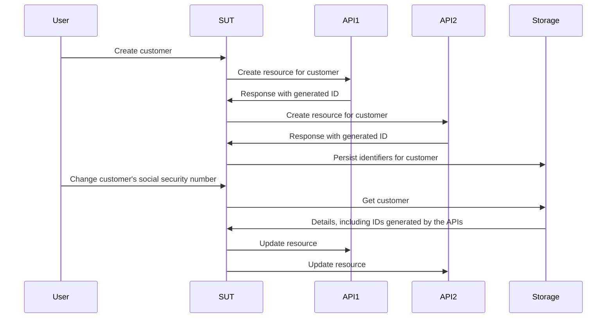

# 모킹, 스텁 및 스파이 없이 작업하기

이 챕터는 테스트 더블의 세계를 탐구하고 테스트 및 개발 프로세스에 어떤 영향을 미치는지 살펴봅니다. 전통적인 모킹, 스텁 및 스파이의 한계를 밝히고 페이크와 계약을 사용한 더 효율적이고 적응 가능한 접근 방식을 소개합니다.

## 요약

- 모킹, 스파이 및 스텁은 각 테스트에서 종속성의 동작에 대한 가정을 임시로 인코딩하도록 권장합니다.
- 이러한 가정은 일반적으로 수동 검사 외에 검증되지 않으므로 테스트 스위트의 유용성을 위협합니다.
- 페이크와 계약은 대안보다 검증된 가정과 더 나은 재사용으로 테스트 더블을 만드는 더 지속 가능한 방법을 제공합니다.

이 챕터는 일반적인 것보다 길므로 입맛 돋우기로 먼저 [예제 저장소](https://github.com/quii/go-fakes-and-contracts)를 탐구하세요. 특히 [planner 테스트](https://github.com/quii/go-fakes-and-contracts/blob/main/domain/planner/planner_test.go)를 확인하세요.

---

[모킹](https://quii.gitbook.io/learn-go-with-tests/go-fundamentals/mocking)에서 모킹, 스텁 및 스파이가 [의존성 주입](https://quii.gitbook.io/learn-go-with-tests/go-fundamentals/dependency-injection)과 함께 코드 단위의 동작을 제어하고 검사하는 데 유용한 도구라는 것을 배웠습니다.

그러나 프로젝트가 성장함에 따라 이러한 종류의 테스트 더블은 유지 관리 부담이 *될 수* 있으며, 대신 시스템을 쉽게 추론하고 테스트할 수 있도록 다른 설계 아이디어를 살펴봐야 합니다.

**페이크**와 **계약**은 개발자가 더 현실적인 시나리오로 시스템을 테스트하고, 더 빠르고 정확한 피드백 루프로 로컬 개발 경험을 개선하고, 진화하는 종속성의 복잡성을 관리할 수 있게 합니다.

### 테스트 더블 입문

저 같은 사람들이 테스트 더블의 명명법에 대해 pedantic할 때 눈을 굴리기 쉽지만, 테스트 더블의 독특한 종류는 이 주제와 우리가 만드는 트레이드오프에 대해 명확하게 이야기하는 데 도움이 됩니다.

**테스트 더블**은 테스트 중인 **피시험 대상(SUT)**에 대해 제어할 수 있는 종속성을 구성하는 다양한 방법에 대한 집합 명사입니다. 테스트 더블은 종종 실제 종속성을 사용하는 것보다 더 나은 대안입니다 다음과 같은 문제를 피할 수 있기 때문입니다

- API를 사용하기 위해 인터넷 필요
- 지연 시간 및 기타 성능 문제 방지
- 비행복한 경로 케이스를 실행할 수 없음
- 다른 팀의 빌드에서 분리
  - 다른 팀의 엔지니어가 실수로 버그를 배송하면 배포를 방지하고 싶지 않을 것입니다

Go에서는 일반적으로 인터페이스로 종속성을 모델링한 다음 테스트에서 동작을 제어하기 위해 자체 버전을 구현합니다. **이 게시물에서 다루는 테스트 더블의 종류는 다음과 같습니다**.

가상의 레시피 API의 이 인터페이스가 주어지면:

```go
type RecipeBook interface {
	GetRecipes() ([]Recipe, error)
	AddRecipes(...Recipe) error
}
```

`RecipeBook`을 사용하는 것을 테스트하는 방법에 따라 다양한 방법으로 테스트 더블을 구성할 수 있습니다.

**스텁**은 호출될 때마다 동일한 미리 준비된 데이터를 반환합니다

```go
type StubRecipeStore struct {
	recipes []Recipe
	err     error
}

func (s *StubRecipeStore) GetRecipes() ([]Recipe, error) {
	return s.recipes, s.err
}

// AddRecipes는 간결함을 위해 생략
```

```go
// 테스트에서 스텁을 설정하여 항상 특정 레시피 또는 에러를 반환하도록 할 수 있습니다
stubStore := &StubRecipeStore{
	recipes: someRecipes,
}
```

**스파이**는 스텁과 같지만 호출된 방법도 기록하므로 테스트가 SUT가 특정 방식으로 종속성을 호출하는지 어설션할 수 있습니다.

```go
type SpyRecipeStore struct {
	AddCalls [][]Recipe
	err      error
}

func (s *SpyRecipeStore) AddRecipes(r ...Recipe) error {
	s.AddCalls = append(s.AddCalls, r)
	return s.err
}

// GetRecipes는 간결함을 위해 생략
```

```go
// 테스트에서
spyStore := &SpyRecipeStore{}
sut := NewThing(spyStore)
sut.DoStuff()

// 이제 spyStore.AddCalls를 검사하여 스토어에 올바른 레시피가 추가되었는지 확인할 수 있습니다
```

**모킹**은 위의 상위 집합과 같지만 특정 호출에만 특정 데이터로 응답합니다. SUT가 잘못된 인수로 종속성을 호출하면 일반적으로 패닉합니다.

```go
// 예상 호출로 모킹 설정
mockStore := &MockRecipeStore{}
mockStore.WhenCalledWith(someRecipes).Return(someError)

// sut가 종속성을 사용할 때 someRecipes로 호출하지 않으면 일반적으로 모킹은 패닉합니다
```

**페이크**는 종속성의 진정한 버전과 같지만 빠르게 실행되는 신뢰할 수 있는 테스트와 로컬 개발에 더 적합한 방식으로 구현됩니다. 종종 시스템에는 지속성에 대한 추상화가 있으며 데이터베이스로 구현되지만 테스트에서는 대신 인메모리 페이크를 사용할 수 있습니다.

```go
type FakeRecipeStore struct {
	recipes []Recipe
}

func (f *FakeRecipeStore) GetRecipes() ([]Recipe, error) {
	return f.recipes, nil
}

func (f *FakeRecipeStore) AddRecipes(r ...Recipe) error {
	f.recipes = append(f.recipes, r...)
	return nil
}
```

페이크가 유용한 이유:

- 상태 유지는 통합 테스트와 같은 여러 피시험 대상과 호출을 포함하는 테스트에 유용합니다. 다른 종류의 테스트 더블로 상태를 관리하는 것은 일반적으로 권장되지 않습니다.
- 합리적인 API가 있으면 상태를 어설션하는 더 자연스러운 방법을 제공합니다. 종속성에 대한 특정 호출을 스파이하는 대신 최종 상태를 쿼리하여 원하는 실제 효과가 발생했는지 확인할 수 있습니다.
- 실제 종속성을 스핀업하거나 의존하지 않고 로컬에서 애플리케이션을 실행하는 데 사용할 수 있습니다. 페이크가 실제 대응물보다 더 빠르고 안정적이기 때문에 일반적으로 개발자 경험(DX)이 향상됩니다.

스파이, 모킹 및 스텁은 일반적으로 도구를 사용하거나 리플렉션을 사용하여 인터페이스에서 자동 생성할 수 있습니다. 그러나 페이크는 더블을 만들려는 종속성의 동작을 인코딩하므로 구현의 적어도 대부분을 직접 작성해야 합니다

## 스텁과 모킹의 문제

[안티패턴](https://quii.gitbook.io/learn-go-with-tests/meta/anti-patterns)에서 테스트 더블 사용은 신중하게 해야 한다는 세부 정보가 있습니다. 취향 있게 사용하지 않으면 지저분한 테스트 스위트를 만들기 쉽습니다. 그러나 프로젝트가 성장함에 따라 다른 문제가 들어올 수 있습니다.

테스트 더블에 동작을 인코딩하면 실제 종속성이 어떻게 작동하는지에 대한 가정을 테스트에 추가합니다. 더블의 동작과 실제 종속성 사이에 불일치가 있거나 시간이 지남에 따라 발생하면(예: 실제 종속성이 변경되는데, 이것은 *예상*해야 합니다) **통과하는 테스트가 있지만 실패하는 소프트웨어가 있을 수 있습니다**.

특히 스텁, 스파이 및 모킹은 프로젝트가 성장함에 따라 다른 도전을 나타냅니다. 이를 설명하기 위해 제가 작업한 프로젝트를 설명하겠습니다.

### 예제 사례 연구

*일부 세부 정보는 실제로 발생한 것과 비교하여 변경되었으며 간결함을 위해 크게 단순화되었습니다. **실제 인물과의 유사성은 순전히 우연입니다.***

저는 전 세계의 다른 팀이 작성하고 유지 관리하는 **여섯** 개의 다른 API를 호출해야 하는 시스템에서 작업했습니다. 그들은 _REST-ish_였고, 우리 시스템의 역할은 그들 모두에서 리소스를 생성하고 관리하는 것이었습니다. 각 시스템에 대해 모든 API를 올바르게 호출하면 _마법_(비즈니스 가치)이 발생합니다.

우리 애플리케이션은 헥사고날 / 포트 & 어댑터 아키텍처로 구조화되었습니다. 도메인 코드는 우리가 다뤄야 하는 외부 세계의 혼란에서 분리되었습니다. 우리의 "어댑터"는 실제로 다양한 API를 호출하는 것을 캡슐화하는 Go 클라이언트였습니다.


#### 문제

당연히 우리는 시스템 구축에 테스트 주도 접근 방식을 취했습니다. 다운스트림 API 응답을 시뮬레이션하기 위해 스텁을 활용하고 모든 것이 작동해야 한다는 것을 안심시키기 위해 소수의 인수 테스트를 가졌습니다.

그러나 대부분 호출해야 하는 API는:

- 문서화가 잘 되지 않음
- 다른 상충되는 우선순위와 압박이 많은 팀이 운영하여 시간을 내기 어려웠음
- 종종 테스트 커버리지가 부족하여 재미있고 예상치 못한 방식으로 깨지고, 회귀 등
- 여전히 구축되고 진화 중

이것은 **많은 불안정한 테스트**와 많은 두통으로 이어졌습니다. *상당한* 양의 시간을 Slack에서 바쁜 사람들에게 핑하면서 다음에 대한 답변을 얻으려고 했습니다:

- API가 왜 `x`를 시작했습니까?
- `y`를 할 때 API가 왜 다른 것을 합니까?

소프트웨어 개발은 희망하는 것처럼 간단하지 않습니다; 학습 연습입니다. 외부 API가 어떻게 작동하는지 지속적으로 배워야 했습니다. 배우고 적응하면서 테스트 스위트를 업데이트하고 추가해야 했으며, 특히 **스텁을 API의 실제 동작과 일치하도록 변경**해야 했습니다.

문제는 이것이 많은 시간을 차지하고 더 많은 실수로 이어졌다는 것입니다. 종속성에 대한 지식이 변경되면 스텁의 동작을 변경하기 위해 **올바른** 테스트를 찾아야 하고, 동일한 종속성을 나타내는 다른 스텁에서 업데이트하는 것을 소홀히 할 실제 위험이 있습니다.

#### 테스트 전략

또한 시스템이 성장하고 요구 사항이 변경됨에 따라 테스트 전략이 적합하지 않다는 것을 깨달았습니다. 시스템 전체가 작동한다는 자신감을 줄 소수의 인수 테스트와 작성한 다양한 패키지에 대한 많은 단위 테스트가 있었습니다.

<u>그 사이에 무언가가 필요했습니다</u>; 종종 시스템의 다양한 부분의 동작을 함께 변경하고 싶었지만 **인수 테스트를 위해 *전체* 시스템을 스핀업할 필요가 없었습니다**. 단위 테스트만으로는 다양한 구성 요소가 전체로서 작동한다는 자신감을 주지 못했습니다; 달성하려는 것에 대한 이야기를 말하고(그리고 검증할) 수 없었습니다. **통합 테스트가 필요했습니다**.

#### 통합 테스트

통합 테스트는 두 개 이상의 "단위"가 결합(또는 통합!)되었을 때 올바르게 작동하는지 증명합니다. 이러한 단위는 작성한 코드 또는 데이터베이스와 같은 다른 사람의 코드와 통합된 작성한 코드일 수 있습니다.

프로젝트가 성장함에 따라 시스템의 많은 부분이 "함께 유지"되는지 - 또는 통합되는지 증명하기 위해 더 많은 통합 테스트를 작성하고 싶습니다!

더 많은 블랙박스 인수 테스트를 작성하려는 유혹이 있을 수 있지만 빌드 시간과 유지 관리 비용 면에서 빠르게 비용이 많이 듭니다. 시스템의 *하위 집합*(단일 단위가 아닌)이 어떻게 동작해야 하는지만 확인하고 싶을 때 전체 시스템을 스핀업하는 것은 너무 비쌀 수 있습니다. 모든 기능에 대해 비싼 블랙박스 테스트를 작성하는 것은 더 큰 시스템에서 지속 가능하지 않습니다.

#### 등장: 페이크

문제는 단위가 테스트되는 방식이 대부분 *무상태*인 스텁에 의존했다는 것입니다. 시작 시 리소스를 만들고 나중에 편집할 수 있는 여러 *상태* API 호출을 다루는 테스트를 작성하고 싶었습니다.

다음은 우리가 하고 싶은 테스트의 축소 버전입니다.

SUT는 "사용 사례" 요청을 처리하는 "서비스 레이어"입니다. 고객이 생성되면 세부 정보가 변경될 때 해당 API에서 만든 리소스를 성공적으로 업데이트한다는 것을 증명하고 싶습니다.

다음은 사용자 스토리로 팀에게 주어진 요구 사항입니다.

> ***Given*** 사용자가 API 1, 2 및 3에 등록되었을 때
>
> ***When*** 고객의 사회 보장 번호가 변경되면
>
> ***Then*** 변경 사항이 API 1, 2 및 3에 전파됩니다



여러 단위에 걸친 테스트는 **상태를 유지하는 데 적합하지 않기 때문에** 일반적으로 스텁과 호환되지 않습니다. 블랙박스 인수 테스트를 작성_할 수_ 있지만 이러한 테스트의 비용은 빠르게 통제 불능이 됩니다.

또한 블랙박스 테스트로 엣지 케이스를 테스트하는 것은 종속성을 제어할 수 없기 때문에 복잡합니다. 예를 들어 하나의 API 호출이 실패하면 롤백 메커니즘이 발동될 것임을 증명하고 싶었습니다.

**페이크**를 사용해야 했습니다. 인메모리 페이크로 종속성을 상태가 있는 API로 모델링함으로써 훨씬 더 넓은 범위의 통합 테스트를 작성할 수 있었고, 전체 시스템을 스핀업*할 필요 없이* **실제 사용 사례가 작동하는지 테스트**할 수 있었으며, 대신 단위 테스트와 거의 같은 속도를 가졌습니다.


페이크를 사용하면 **복잡한 스파이에 의존하는 대신 해당 시스템의 최종 상태를 기반으로 어설션을 만들 수 있습니다**. 각 페이크에 고객에 대해 보유한 레코드를 묻고 업데이트되었는지 어설션합니다. 이것은 더 자연스럽게 느껴집니다; 시스템을 수동으로 확인하면 특정 JSON 페이로드를 보냈는지 확인하기 위해 요청 로그를 검사하는 것이 아니라 해당 API를 쿼리하여 상태를 확인할 것입니다.

```go
// 레고 블록을 가져와서 테스트를 위한 시스템 조립
fakeAPI1 := fakes.NewAPI1()
fakeAPI2 := fakes.NewAPI2() // 등..
customerService := customer.NewService(fakeAPI1, fakeAPI2, etc...)

// 새 고객 생성
newCustomerRequest := NewCustomerReq{
	// ...
}
createdCustomer, err := customerService.New(newCustomerRequest)
assert.NoErr(t, err)

// 자연스러운 방식으로 다양한 페이크에서 모든 세부 정보가 예상대로인지 확인할 수 있습니다, 일반 API처럼
fakeAPI1Customer := fakeAPI1.Get(createdCustomer.FakeAPI1Details.ID)
assert.Equal(t, fakeAPI1Customer.SocialSecurityNumber, newCustomerRequest.SocialSecurityNumber)

// 관심 있는 다른 api에 대해 반복

// 고객 업데이트
updatedCustomerRequest := NewUpdateReq{SocialSecurityNumber: "123", InternalID: createdCustomer.InternalID}
assert.NoErr(t, customerService.Update(updatedCustomerRequest))

// 다시 다양한 페이크를 확인하여 상태가 원하는 대로 끝나는지 확인할 수 있습니다
updatedFakeAPICustomer := fakeAPI1.Get(createdCustomer.FakeAPI1Details.ID)
assert.Equal(t, updatedFakeAPICustomer.SocialSecurityNumber, updatedCustomerRequest.SocialSecurityNumber)
```

이것은 스파이를 통해 만든 다양한 함수 호출 인수를 확인하는 것보다 작성하기 더 간단하고 읽기 더 쉽습니다.

이 접근 방식을 통해 시스템의 넓은 부분에 걸친 테스트를 할 수 있어 스탠드업에서 논의할 사용 사례에 대한 더 **의미 있는** 테스트를 작성할 수 있으면서도 매우 빠르게 실행됩니다.

#### 페이크는 캡슐화의 더 많은 이점을 가져옵니다

위의 예에서 테스트는 종속성의 동작에 대해 최종 상태를 확인하는 것 외에 관심이 없었습니다. 종속성의 페이크 버전을 만들고 테스트 중인 시스템 부분에 주입했습니다.

모킹/스텁을 사용하면 특정 시나리오를 처리하고 특정 데이터를 반환하도록 각 종속성을 설정해야 합니다. 이것은 동작과 구현 세부 정보를 테스트로 가져와 캡슐화의 이점을 약화시킵니다.

인터페이스 뒤에 종속성을 모델링하여 클라이언트로서 _어떻게 작동하는지 신경 쓸 필요가 없지만_, "mockist" 접근 방식에서는 _모든 테스트에서 신경 써야 합니다_.

#### 페이크의 유지 관리 비용

페이크는 적어도 작성된 코드 측면에서 다른 테스트 더블보다 비용이 더 듭니다; 상태를 유지하고 페이크하는 것의 동작을 시뮬레이션해야 합니다. 페이크와 실제 것 사이의 동작 불일치는 테스트가 현실과 일치하지 않을 **위험**이 있습니다. 이것은 통과하는 테스트가 있지만 깨진 소프트웨어가 있는 시나리오로 이어집니다.

다른 시스템과 통합할 때마다 다른 팀의 API든 데이터베이스든 동작에 따라 가정을 합니다. 이것들은 API 문서, 대면 대화, 이메일, Slack 스레드 등에서 캡처할 수 있습니다.

**가정을 코드화**하여 페이크 *와* 실제 시스템 모두에 대해 실행하여 지식이 반복 가능하고 문서화된 방식으로 올바른지 확인하는 것이 도움이 되지 않겠습니까?

**계약**은 이 목적을 위한 수단입니다. 다른 팀의 시스템에 대해 만든 가정을 관리하고 명시적으로 만드는 데 도움이 되었습니다. 이메일 교환이나 끝없는 Slack 스레드보다 훨씬 더 명시적이고 유용합니다!


계약을 가지면 페이크와 실제 종속성을 상호 교환적으로 사용할 수 있다고 가정할 수 있습니다. 이것은 테스트 구성에만 유용한 것이 아니라 로컬 개발에도 유용합니다.

다음은 시스템이 의존하는 API 중 하나에 대한 계약의 예입니다

```go
type API1Customer struct {
	Name string
	ID   string
}

type API1 interface {
	CreateCustomer(ctx context.Context, name string) (API1Customer, error)
	GetCustomer(ctx context.Context, id string) (API1Customer, error)
	UpdateCustomer(ctx context.Context, id string, name string) error
}

type API1Contract struct {
	NewAPI1 func() API1
}

func (c API1Contract) Test(t *testing.T) {
	t.Run("can create, get and update a customer", func(t *testing.T) {
		var (
			ctx  = context.Background()
			sut  = c.NewAPI1()
			name = "Bob"
		)

		customer, err := sut.CreateCustomer(ctx, name)
		expect.NoErr(t, err)

		got, err := sut.GetCustomer(ctx, customer.ID)
		expect.NoErr(t, err)
		expect.Equal(t, customer, got)

		newName := "Robert"
		expect.NoErr(t, sut.UpdateCustomer(ctx, customer.ID, newName))

		got, err = sut.GetCustomer(ctx, customer.ID)
		expect.NoErr(t, err)
		expect.Equal(t, newName, got.Name)
	})

	// 예상치 못한 이상한 동작의 예
	t.Run("the system will not allow you to add 'Dave' as a customer", func(t *testing.T) {
		var (
			ctx  = context.Background()
			sut  = c.NewAPI1()
			name = "Dave"
		)

		_, err := sut.CreateCustomer(ctx, name)
		expect.Err(t, ErrDaveIsForbidden)
	})
}
```

[인수 테스트 확장하기](https://quii.gitbook.io/learn-go-with-tests/testing-fundamentals/scaling-acceptance-tests)에서 논의한 것처럼 구체적인 타입이 아닌 인터페이스에 대해 테스트하면 테스트가:

- 구현 세부 정보에서 분리됨
- 다른 컨텍스트에서 재사용 가능

이것이 계약의 요구 사항입니다. 페이크를 확인하고 개발 _하고_ 실제 구현에 대해 테스트할 수 있습니다.

인메모리 페이크를 만들기 위해 테스트에서 계약을 사용할 수 있습니다.

```go
func TestInMemoryAPI1(t *testing.T) {
	API1Contract{NewAPI1: func() API1 {
		return inmemory.NewAPI1()
	}}.Test(t)
}
```

그리고 여기 페이크의 코드가 있습니다

```go
func NewAPI1() *API1 {
	return &API1{customers: make(map[string]planner.API1Customer)}
}

type API1 struct {
	i         int
	customers map[string]planner.API1Customer
}

func (a *API1) CreateCustomer(ctx context.Context, name string) (planner.API1Customer, error) {
	if name == "Dave" {
		return planner.API1Customer{}, ErrDaveIsForbidden
	}

	newCustomer := planner.API1Customer{
		Name: name,
		ID:   strconv.Itoa(a.i),
	}
	a.customers[newCustomer.ID] = newCustomer
	a.i++
	return newCustomer, nil
}

func (a *API1) GetCustomer(ctx context.Context, id string) (planner.API1Customer, error) {
	return a.customers[id], nil
}

func (a *API1) UpdateCustomer(ctx context.Context, id string, name string) error {
	customer := a.customers[id]
	customer.Name = name
	a.customers[id] = customer
	return nil
}
```

### 소프트웨어 진화

대부분의 소프트웨어는 한 번에 "완료"되지 않습니다.

고객 요구와 기타 외부 변화에 적응하는 점진적인 학습 연습입니다. 예제에서 호출하던 API도 진화하고 변경되었으며, 게다가 *우리* 소프트웨어를 개발하면서 _정말로_ 만들어야 할 시스템에 대해 더 많이 배웠습니다. 계약에서 만든 가정이 틀렸거나 _틀려졌습니다_.

다행히 계약 설정이 완료되면 변경을 처리하는 간단한 방법이 있었습니다. 버그가 수정되거나 동료가 API가 변경된다고 알려주면서 새로운 것을 배우면:

1. 새 시나리오를 실행하는 테스트를 작성합니다. 이 중 일부는 페이크에서 동작을 시뮬레이션하도록 **추진**하기 위해 계약을 변경하는 것입니다
2. 테스트 실행이 실패해야 하지만, 다른 무엇보다도 먼저 실제 종속성에 대해 계약을 실행하여 계약 변경이 유효한지 확인합니다.
3. 계약에 맞도록 페이크를 업데이트합니다.
4. 테스트를 통과시킵니다.
5. 리팩토링합니다.
6. 모든 테스트를 실행하고 배송합니다.

체크인하기 전에 _전체_ 테스트 스위트를 실행하면 페이크의 동작이 다르기 때문에 다른 테스트가 실패할 _수_ 있습니다. 이것은 **좋은 것**입니다! 이제 변경된 시스템에 의존하는 시스템의 다른 모든 영역을 수정할 수 있습니다; 프로덕션에서도 이 시나리오를 처리할 것이라고 자신합니다. 이 접근 방식 없이는 모든 관련 테스트를 *기억하여* 찾고 스텁을 업데이트해야 합니다. 오류가 발생하기 쉽고, 노동 집약적이고 지루합니다.

### 우수한 개발자 경험

해당 계약이 있는 페이크 스위트가 있으면 슈퍼파워처럼 느껴졌습니다. 드디어 다뤄야 하는 API의 복잡성을 길들일 수 있었습니다.

다양한 시나리오에 대한 테스트 작성이 훨씬 간단해졌습니다. 더 이상 모든 테스트에 대해 일련의 스텁과 스파이를 조립할 필요가 없었습니다; 단위 또는 모듈 세트(페이크, 자체 "서비스")를 가져와서 필요한 다양한 이상하고 놀라운 시나리오를 실행하기 위해 매우 쉽게 조립할 수 있었습니다.

스텁, 스파이 또는 모킹을 사용하는 모든 테스트는 임시 설정으로 인해 외부 시스템이 어떻게 동작하는지 _신경 써야_ 합니다. 반면에 페이크는 세부 정보가 숨겨져 있고 그냥 사용할 수 있는 다른 잘 캡슐화된 코드 단위처럼 취급할 수 있습니다.

로컬에서 매우 현실적인 버전의 시스템을 실행할 수 있었고, 모두 메모리에 있었기 때문에 매우 빠르게 시작하고 실행되었습니다. 이것은 스위트가 얼마나 포괄적인지를 고려하면 테스트 시간이 매우 빠르다는 것을 의미했고 매우 인상적으로 느껴졌습니다.

스테이징 환경에서 인수 테스트가 실패하면 첫 번째 단계는 의존하는 API에 대해 계약을 실행하는 것이었습니다. 종종 **다른 시스템 개발자들보다 먼저** 문제를 식별했습니다.

### 데코레이터로 행복한 경로에서 벗어나기

에러 시나리오의 경우 스텁이 더 편리한데 테스트에서 *어떻게* 동작하는지에 직접 접근할 수 있는 반면 페이크는 상당히 블랙박스인 경향이 있습니다. 이것은 의도적인 설계 선택인데, 사용자(예: 테스트)가 어떻게 작동하는지 관심을 갖지 않기를 원합니다; 계약의 뒷받침으로 인해 올바른 일을 한다고 신뢰해야 합니다.

페이크를 실패시켜 비행복한 경로 문제를 실행하는 방법은?

개발자로서 소스를 변경하지 않고 일부 코드의 동작을 수정해야 하는 시나리오가 많이 있습니다. **데코레이터 패턴**은 종종 코드 단위를 가져와서 로깅, 텔레메트리, 재시도 등을 추가하는 방법입니다. 필요할 때 동작을 재정의하기 위해 페이크를 래핑하는 데 사용할 수 있습니다.

`API1` 예로 돌아가서 필요한 인터페이스를 구현하고 페이크를 감싸는 타입을 만들 수 있습니다.

```go
type API1Decorator struct {
	delegate           API1
	CreateCustomerFunc func(ctx context.Context, name string) (API1Customer, error)
	GetCustomerFunc    func(ctx context.Context, id string) (API1Customer, error)
	UpdateCustomerFunc func(ctx context.Context, id string, name string) error
}

// API1Decorator가 API1을 구현하는지 어설션
var _ API1 = &API1Decorator{}

func NewAPI1Decorator(delegate API1) *API1Decorator {
	return &API1Decorator{delegate: delegate}
}

func (a *API1Decorator) CreateCustomer(ctx context.Context, name string) (API1Customer, error) {
	if a.CreateCustomerFunc != nil {
		return a.CreateCustomerFunc(ctx, name)
	}
	return a.delegate.CreateCustomer(ctx, name)
}

func (a *API1Decorator) GetCustomer(ctx context.Context, id string) (API1Customer, error) {
	if a.GetCustomerFunc != nil {
		return a.GetCustomerFunc(ctx, id)
	}
	return a.delegate.GetCustomer(ctx, id)
}

func (a *API1Decorator) UpdateCustomer(ctx context.Context, id string, name string) error {
	if a.UpdateCustomerFunc != nil {
		return a.UpdateCustomerFunc(ctx, id, name)
	}
	return a.delegate.UpdateCustomer(ctx, id, name)
}
```

테스트에서 `XXXFunc` 필드를 사용하여 스텁, 스파이 또는 모킹처럼 테스트 더블의 동작을 수정할 수 있습니다.

```go
failingAPI1 = NewAPI1Decorator(inmemory.NewAPI1())
failingAPI1.UpdateCustomerFunc = func(ctx context.Context, id string, name string) error {
	return errors.New("failed to update customer")
}
```

그러나 이것은 _어색_하고 판단을 행사해야 합니다. 이 접근 방식에서는 테스트에서 페이크에 임시 동작을 도입하기 때문에 계약의 보장을 잃고 있습니다.

컨텍스트를 검토하는 것이 가장 좋으며, 스텁을 사용하여 단위 테스트 수준에서 특정 비행복 경로를 테스트하는 것이 더 간단하다고 결론을 내릴 수 있습니다.

### 이 추가 코드는 낭비가 아닌가요?

고객에게 서비스를 제공하는 코드만 작성하고 효율적으로 구축할 수 있는 시스템을 기대해야 한다고 믿는 것은 희망적인 생각입니다. 사람들은 낭비가 무엇인지에 대해 매우 왜곡된 의견을 가지고 있습니다(제 게시물 참조: [헨리 포드의 유령이 개발팀을 망치고 있습니다](https://quii.dev/The_ghost_of_Henry_Ford_is_ruining_your_development_team)).

자동화된 테스트는 고객에게 직접적인 이점을 주지 않지만 작업을 더 효율적으로 만들기 위해 작성합니다(커버리지 점수를 쫓기 위해 테스트를 작성하지 않죠, 맞죠?).

엔지니어는 디버그, 테스트 및 문제 수정을 위해 시나리오를 쉽게 시뮬레이션(임시가 아닌 반복 가능한 방식으로)할 수 있어야 합니다. **인메모리 페이크와 좋은 모듈 설계를 통해 시나리오에 대한 관련 액터를 격리하여 매우 저렴하게 빠르고 적절한 테스트를 작성할 수 있습니다**. 이 유연성을 통해 개발자는 얽힌 엉망보다 훨씬 더 관리하기 쉽게 시스템을 반복할 수 있으며, 작성하고 실행하기 비싼 블랙박스 테스트 또는 더 나쁘게는 공유 환경에서 수동 테스트를 통해 테스트됩니다.

이것은 [simple vs. easy](https://www.youtube.com/watch?v=SxdOUGdseq4)의 예입니다. 물론 페이크와 계약은 단기적으로 스텁과 스파이보다 더 많은 코드가 작성되지만 장기적으로 더 간단하고 유지 관리 비용이 더 저렴한 시스템이 됩니다. 스파이, 스텁 및 모킹을 조금씩 업데이트하는 것은 노동 집약적이고 오류가 발생하기 쉬운데, 테스트 더블이 올바르게 동작하는지 확인하기 위해 해당 계약이 없을 것이기 때문입니다.

이 접근 방식은 _약간_ 증가된 선행 비용을 나타내지만 계약과 페이크가 설정되면 훨씬 낮은 비용이 듭니다. 페이크는 스텁과 같은 임시 테스트 더블보다 더 재사용 가능하고 신뢰할 수 있습니다.

새 테스트를 작성할 때 스텁을 설정하는 대신 기존의 전투 테스트된 페이크를 사용하면 매우 *해방감*을 주고 **자신감**을 줍니다.

### 이것이 TDD에 어떻게 맞나요?

계약으로 _시작_하는 것을 권장하지 않습니다; 그것은 상향식 설계인데, 일반적으로 더 영리해야 하고 가상의 요구 사항을 과도하게 생각할 위험이 있습니다.

이 기법은 이전 챕터, [TDD의 왜](https://quii.dev/The_Why_of_TDD) 및 [GOOS](http://www.growing-object-oriented-software.com)에서 논의한 "인수 테스트 주도 접근 방식"과 호환됩니다

- 실패하는 [인수 테스트](https://quii.gitbook.io/learn-go-with-tests/testing-fundamentals/scaling-acceptance-tests)를 작성합니다.
- 통과시키기에 충분한 코드를 작성합니다. 일반적으로 API, 데이터베이스 또는 무엇이든에 의존하는 일부 "서비스 레이어"가 됩니다. 일반적으로 인터페이스를 통해 외부 관심사(예: 지속성, 데이터베이스 호출 등)에서 분리된 비즈니스 로직 코드가 있습니다.
- 먼저 인메모리 페이크로 인터페이스를 구현하여 모든 테스트를 로컬에서 통과시키고 초기 설계를 검증합니다.
- 프로덕션에 푸시하려면 인메모리를 사용할 수 없습니다! 페이크에 대해 만든 가정을 계약으로 인코딩합니다.
- 계약을 사용하여 스토어의 MySQL 버전과 같은 실제 종속성을 만듭니다.
- 배송합니다.

## 데이터베이스 테스트에 대한 챕터는 어디 있나요?

이것은 5년 넘게 미룬 일반적인 요청입니다. 이유는 이 챕터가 항상 제 답변이 될 것이기 때문입니다.

<u>데이터베이스 드라이버를 모킹하고 호출을 스파이하지 마세요</u>. 이러한 테스트는 작성하기 어렵고 잠재적으로 가치가 거의 없습니다. 특정 `SQL` 문이 데이터베이스로 전송되었는지 어설션해서는 안 됩니다. 그것은 구현 세부 정보입니다; **테스트는 동작에만 관심을 가져야 합니다**. 특정 SQL 문이 컴파일되었다는 것을 증명하는 것은 코드가 필요한 대로 _동작_한다는 것을 증명하지 _않습니다_.

**계약**은 구현 세부 정보에서 테스트를 분리하고 동작에 집중하도록 강요합니다.

지속성 요구 사항을 주도하기 위해 위에서 설명한 TDD 접근 방식을 따르세요.

[예제 저장소](https://github.com/quii/go-fakes-and-contracts)에는 계약의 몇 가지 예와 일부 지속성 요구 사항의 인메모리 및 SQLite 구현을 테스트하는 데 사용되는 방법이 있습니다.

```go
package inmemory_test

import (
	"github.com/quii/go-fakes-and-contracts/adapters/driven/persistence/inmemory"
	"github.com/quii/go-fakes-and-contracts/domain/planner"
	"testing"
)

func TestInMemoryPantry(t *testing.T) {
	planner.PantryContract{
		NewPantry: func() planner.Pantry {
			return inmemory.NewPantry()
		},
	}.Test(t)
}
```

```go
package sqlite_test

import (
	"github.com/quii/go-fakes-and-contracts/adapters/driven/persistence/sqlite"
	"github.com/quii/go-fakes-and-contracts/domain/planner"
	"testing"
)

func TestSQLitePantry(t *testing.T) {
	client := sqlite.NewSQLiteClient()
	t.Cleanup(func() {
		if err := client.Close(); err != nil {
			t.Error(err)
		}
	})

	planner.PantryContract{
		NewPantry: func() planner.Pantry {
			return sqlite.NewPantry(client)
		},
	}.Test(t)
}
```

Docker 등이 로컬에서 데이터베이스 실행을 더 쉽게 _만들지만_ 여전히 상당한 성능 오버헤드가 있을 수 있습니다. 계약이 있는 페이크를 사용하면 "더 무거운" 종속성 사용을 계약을 검증할 때만 필요하도록 제한하고 다른 종류의 테스트에는 필요하지 않습니다.

*나머지* 시스템에 대한 인수 및 통합 테스트에 인메모리 페이크를 사용하면 훨씬 더 빠르고 간단한 개발자 경험을 제공합니다.

## 마무리

소프트웨어 프로젝트가 공통 목표에 도달하기 위해 동시에 시스템을 구축하는 다양한 팀으로 구성되는 것은 일반적입니다.

이러한 작업 방식은 높은 수준의 협업과 커뮤니케이션이 필요합니다. 많은 사람들이 "API 우선" 접근 방식으로 일부 API 계약(종종 위키 페이지에!)을 정의한 다음 6개월 동안 독립적으로 작업하고 모두 함께 붙일 수 있다고 생각합니다. 코드를 작성하기 시작하면 도메인과 문제를 더 잘 이해하게 되어 가정에 도전하기 때문에 실제로는 잘 작동하지 않습니다. 이러한 지식 변화에 대응해야 하며, 종종 팀 간 변경이 필요합니다.

따라서 이 상황에 있다면 시스템 내부와 외부 모두에서 예측할 수 없는 변경을 처리하도록 시스템을 구조화하고 테스트해야 합니다.

> "소프트웨어 개발에서 고성능 팀의 정의 특성 중 하나는 작은 팀 외부의 사람이나 그룹에게 허락을 구하지 않고 진행하고 마음을 바꿀 수 있는 능력입니다."
>
> Modern Software Engineering
> David Farley

변경 사항을 구체화하기 위해 주간 회의나 Slack 스레드에 의존하지 마세요. **가정을 계약으로 코드화하세요**. 새로운 정보가 밝혀지면 빠른 피드백을 받을 수 있도록 빌드 파이프라인에서 시스템에 대해 해당 계약을 실행하세요. 이러한 계약은 **페이크**와 함께 독립적으로 작업하고 외부 변경을 지속 가능하게 관리할 수 있음을 의미합니다.

### 모듈 모음으로서의 시스템

Farley의 책을 다시 참조하면, **점진주의** 아이디어를 설명하고 있습니다. 소프트웨어 구축은 *지속적인 학습 연습*입니다. 주어진 시스템이 가치를 제공하기 위해 해결해야 하는 요구 사항을 미리 이해하는 것은 비현실적입니다. 따라서 **빠르게 피드백을 수집하고 실험**하도록 시스템과 작업 방식을 최적화해야 합니다.

이 챕터에서 논의된 아이디어를 활용하려면 **모듈형 시스템**이 필요합니다. 신뢰할 수 있는 페이크가 있는 모듈형 코드가 있으면 자동화된 테스트를 통해 시스템을 저렴하게 실험할 수 있습니다.

모듈을 함께 구성하고 다른 데이터를 다른 순서로, 일부 API가 실패하는 등으로 시도하여 이상하지만 가능한(하지만 가능한) 시나리오를 자체 포함된 테스트로 번역하여 문제를 이해하고 더 강력한 소프트웨어를 주도하는 것이 매우 쉬웠습니다.

잘 정의되고 잘 테스트된 모듈을 사용하면 _모든 것을_ 한꺼번에 변경하고 이해하지 않고 시스템을 증분할 수 있습니다.

### 하지만 저는 안정적인 API로 작은 것을 작업하고 있습니다

안정적인 API가 있더라도 개발자 경험, 빌드 등이 다른 사람들의 코드에 긴밀하게 결합되는 것을 원하지 않습니다. 이 접근 방식을 올바르게 수행하면 프로덕션, 로컬 실행 및 신뢰하는 더블로 다양한 종류의 테스트를 작성하기 위해 시스템을 조합하는 구성 가능한 모듈 세트로 끝납니다.

관심 있는 시스템의 부분을 격리하고 해결하려는 실제 문제에 대한 의미 있는 테스트를 작성할 수 있습니다.

### 종속성을 일급 시민으로 만드세요

물론 스텁과 스파이에는 자리가 있습니다. 테스트에서 임시로 종속성의 다른 동작을 시뮬레이션하는 것은 항상 용도가 있지만 비용이 통제 불능이 되지 않도록 주의하세요.

경력에서 너무 많이 재능 있는 개발자가 작성한 신중하게 작성된 소프트웨어가 통합 문제로 인해 무너지는 것을 보았습니다. 통합은 엔지니어에게 어렵습니다 _왜냐하면_ 동시에 변경하는 다른 엔지니어가 작성한 시스템의 정확한 동작을 재현하기가 어렵기 때문입니다.

일부 팀은 모든 사람이 공유 환경에 배포하고 거기서 테스트하는 것에 의존합니다. 문제는 이것이 **격리된** 피드백을 제공하지 않고 **피드백이 느리다**는 것입니다. 여전히 적어도 효율적으로는 아니지만 시스템이 다른 종속성과 어떻게 작동하는지에 대한 다른 실험을 구성할 수 없습니다.

**프로덕션에 도달하기 전에 개발 머신에서 빠르게 테스트/실험할 수 있도록 종속성을 모델링하는 더 정교한 방법을 채택하여 이 복잡성을 길들여야 합니다**. 계약으로 검증된 종속성의 현실적이고 관리 가능한 페이크를 만드세요. 그러면 더 의미 있는 테스트를 작성하고 시스템을 실험하여 성공할 가능성이 높아집니다.
